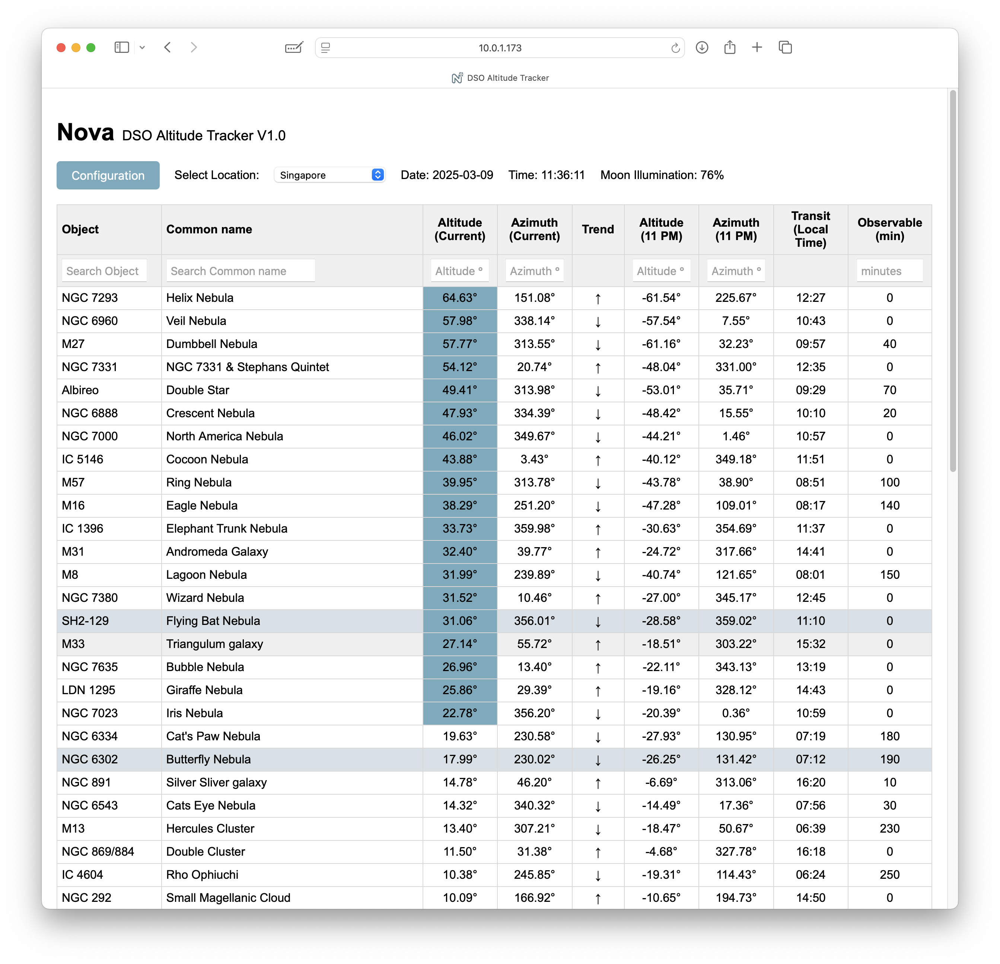
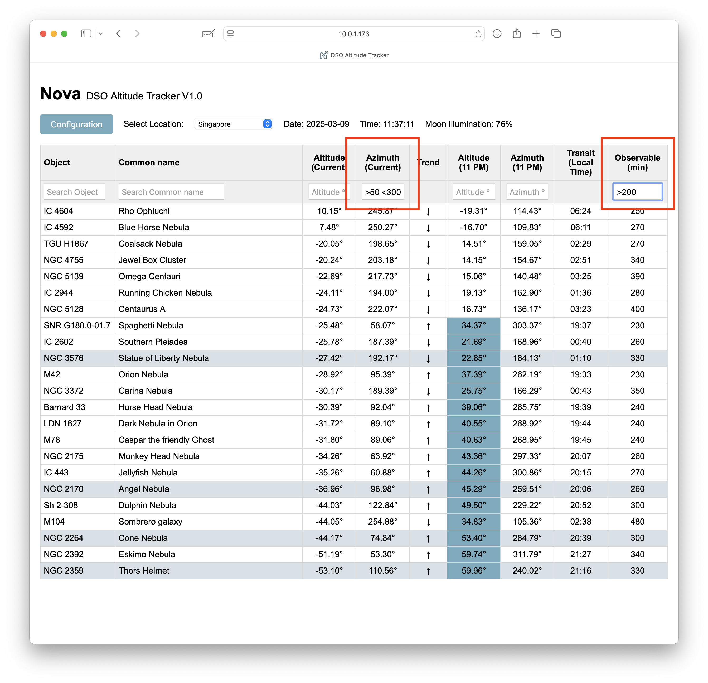
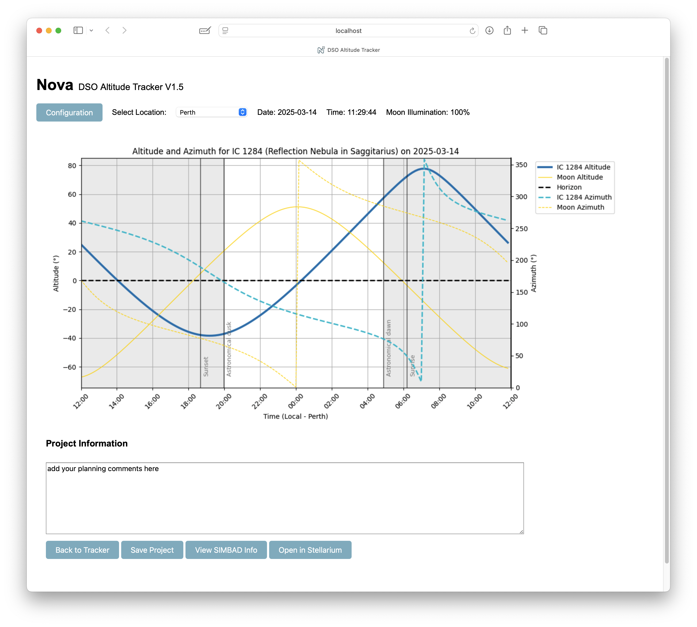

# Nova DSO Altitude Tracker - Quick Guide

### Purpose
Nova helps track Deep Sky Objects (DSOs) positions throughout the night for astrophotography or visual observations.

Nova updates DSOs' positions every minute. Objects marked for special attention are highlighted. It also displays the Moon's illumination and provides graphical insights into the objects' positions throughout the night.

Positions (RA, DEC) are automatically fetched from SIMBAD. Altitude (Alt) and Azimuth (Az) calculations are performed in real time, with updates reflected every minute on the web interface.

### Main Interface
When opening Nova, you'll see a list of DSOs sorted by their current altitude (descending order). You'll also see the date, local time at your selected location, and current Moon illumination. Altitudes above 20° are highlighted. Under "Observable" you can find the time in minutes an object is above 20° altitude between astronomical dusk and dawn.



### Sorting and Searching
- **Sorting:** By default, objects are sorted by descending altitude. You can change sorting by clicking on column headers. Clicking twice reverses the sorting order.
- **Searching:** Each column header includes a search field allowing filtering. You can combine search terms and use logical operators like `<` or `>` for refined filtering. If you want to exclude certain content, use `!`. Nova retains your sorting and filtering choices until you alter them.



### Configuration
Nova comes pre-loaded with several DSOs. You can manage (add, remove, or edit) locations and objects from the configuration screen.
Best way to add an object is to fill in the object ID and click on "search". This will trigger a SIMBAD search and if successful, RA and DEC will automatically be filled in.

- **Object Designations:** SIMBAD may not recognize all object IDs. If unsure, search manually on SIMBAD first, then use the confirmed designation.
- **Highlighting Objects:** Entering text in the "Project" field highlights the corresponding object in the main interface.


### Detailed Object Information
Clicking on a DSO in the main list opens detailed graphical information about its nightly position and altitude. These graphics are generated on-demand and might take a few seconds to appear, depending on your computer's performance.
You will also see 4 buttons: "Back to Tracker" brings you to the home screen, "Safe Project" will safe the content of the project field, "view SIMBAD info" will open SIMBAD underneath the graphic with the corresponding object selected, "Open in Stellarium" will send the object information to Stellarium and focus on it. In order the receive this information, the remote control plugin needs to be activated in Stellarium. Currently this function only works when operating under the same IP address, f.i. on the same computer.



---

# Nova Astronomical Tracker Setup Guide

This guide walks you through setting up your Flask astronomical tracking app, including creating a virtual environment and installing all required dependencies.

## 1. Install Python 3

Using **Homebrew** (recommended):

1. Open **Terminal**.
2. Install Python 3 by running:

```bash
brew install python
```

3. Verify the installation:

```bash
python3 --version
pip3 --version
```

## 2. Create a Project Directory

1. Open **Terminal**.
2. Create and navigate to a new folder for your project:

```bash
mkdir astro_nova
cd astro_nova
```

## 3. Set Up a Virtual Environment

A virtual environment keeps your project's dependencies isolated.

1. Create a virtual environment named `nova`:

```bash
python3 -m venv nova
```

2. Activate the virtual environment:

```bash
source nova/bin/activate
```

Your terminal prompt should now start with `(nova)`.

## 4. Install Required Dependencies

Install the required Python packages:

```bash
pip install Flask numpy pytz ephem PyYAML matplotlib astroquery astropy flask_login python-decouple
```

(Optional) Verify installed packages:

```bash
pip freeze
```

## 5. Set Up Your Project Files

Place the contents of `Nova_x.x` into your `astro_nova` directory.

### Important:
Add your .env file - you can find an example here. Just edit the secret key and safe the file as .env (not.env.example). Once you edit the extension, the file will not be visible by default.

## 6. Run the Application

1. With your virtual environment activated, run:

```bash
python nova.py
```

2. Open your browser and navigate to:

```
http://localhost:5001
```

*Note: The first startup may take a minute.*

## 7. (Optional) Deactivate the Virtual Environment

When finished, deactivate by running:

```bash
deactivate
```

## 8. (Optional) Running it in the background

if you want to close the terminal window, for instance after starting the software on a server, start it like that:

```bash
setsid python3 nova.py > app.log 2>&1 &
```

once you want to later stop it, look for the process:

```bash
ps aux | grep python
```

and stop it:

```bash
kill <the number you've found>
```

## Additional Notes

### Configuration Files:
For security, sensitive values such as SECRET_KEY or passwords should be stored in a .env file or a separate configuration file that is not committed to version control.

### Multi‑user vs. Single‑user Mode:
The app can be configured for multi‑user mode (using separate configuration files per user) or single‑user mode (using a single file like config_default.yaml).

### Dependencies:
If you add more dependencies later, update the installation command accordingly.
