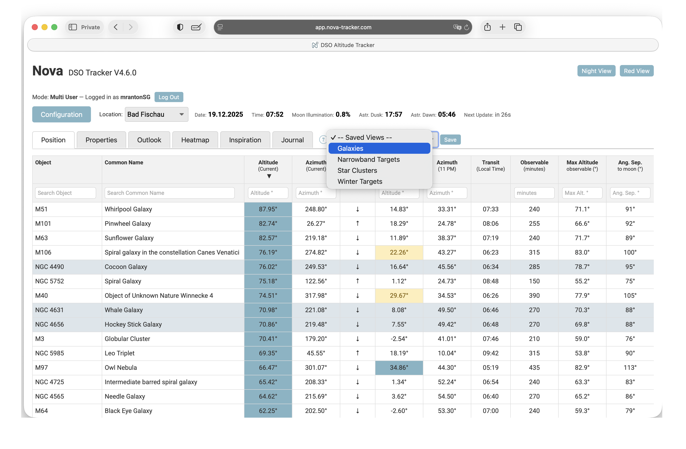
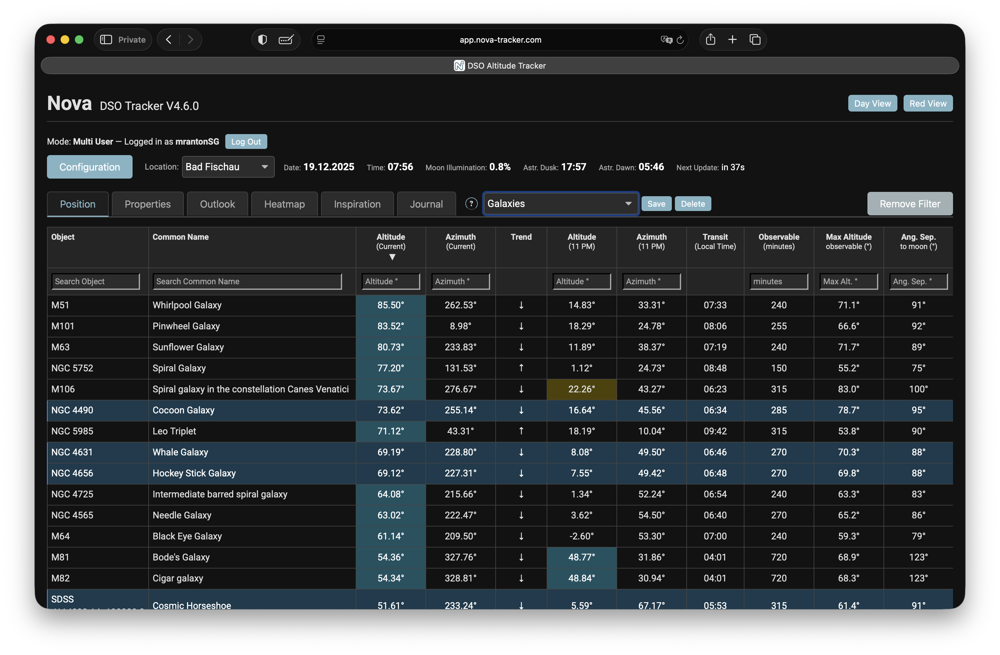
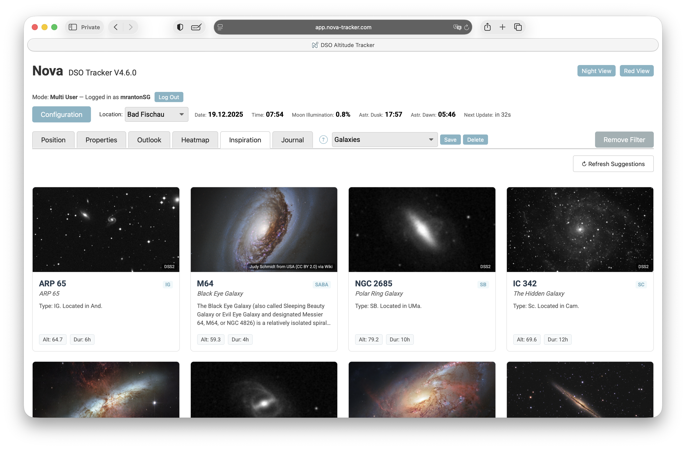
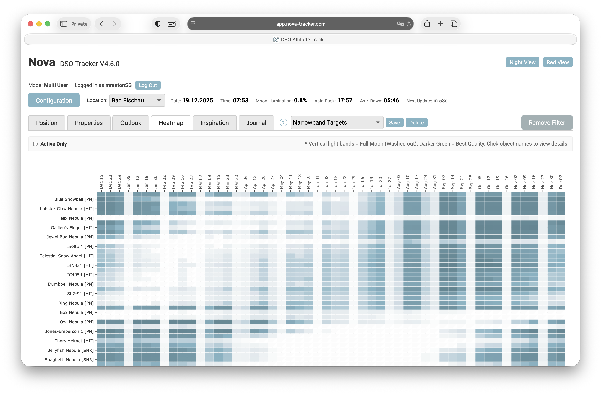
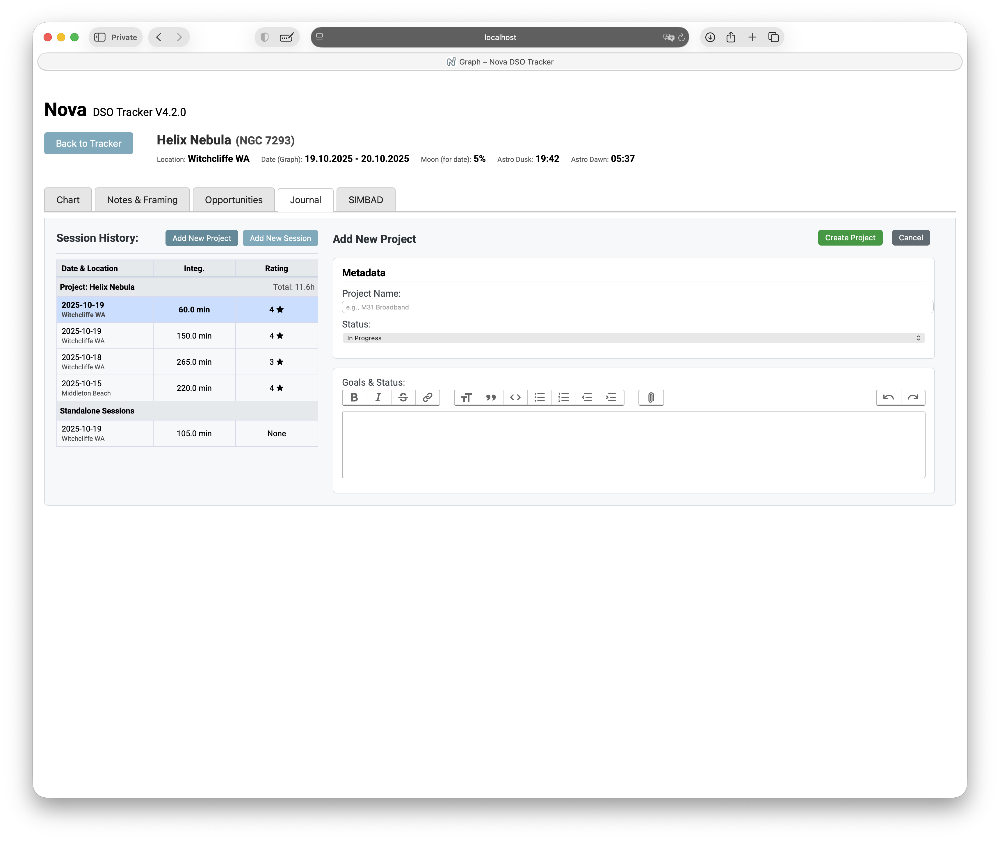
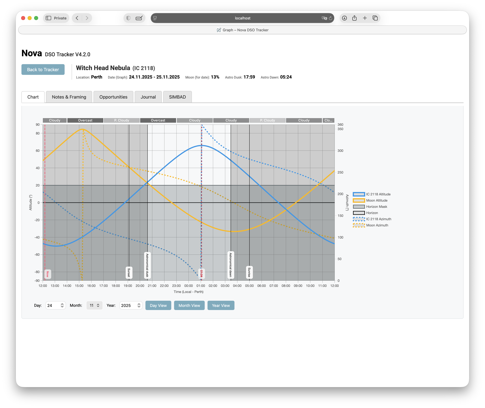
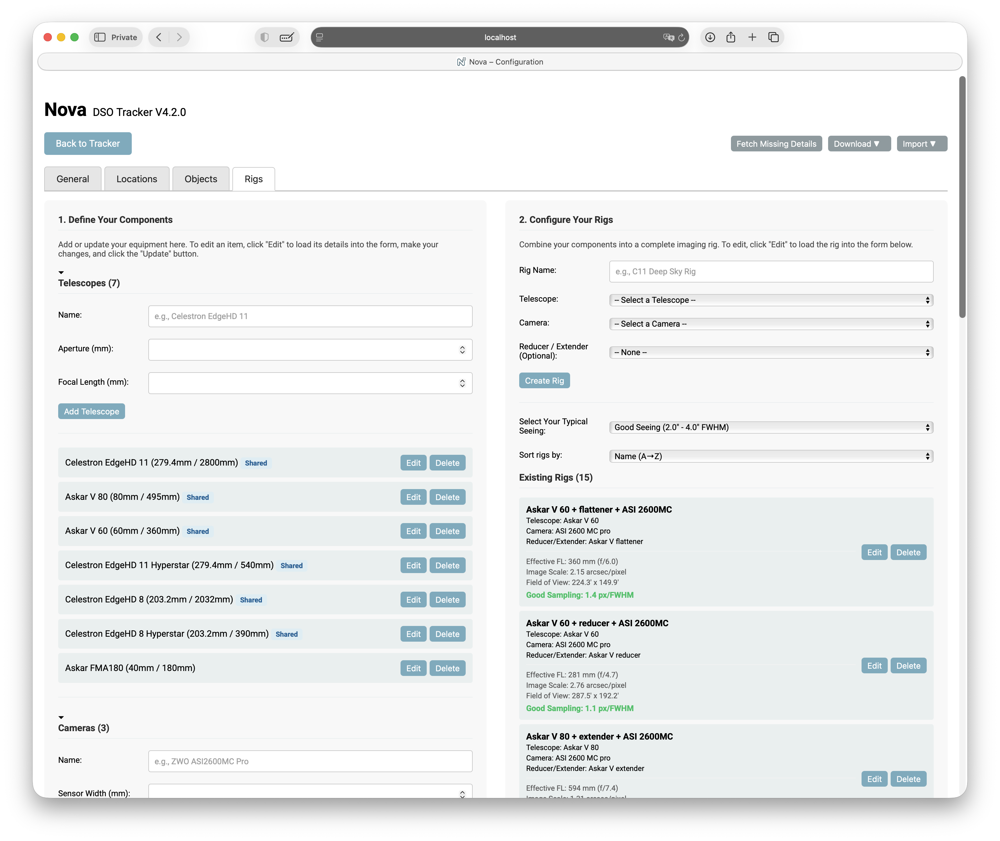
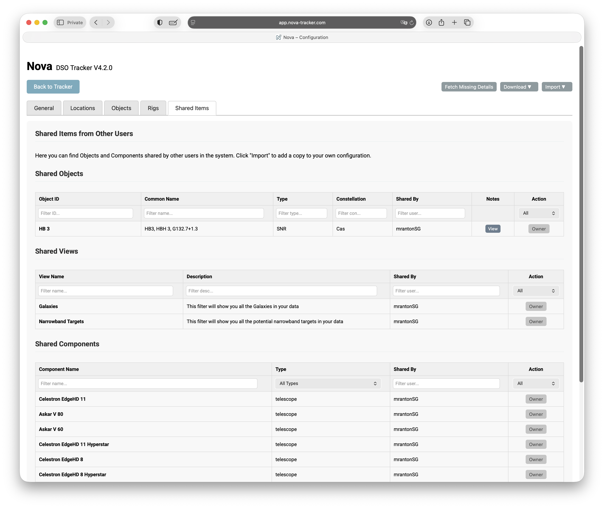
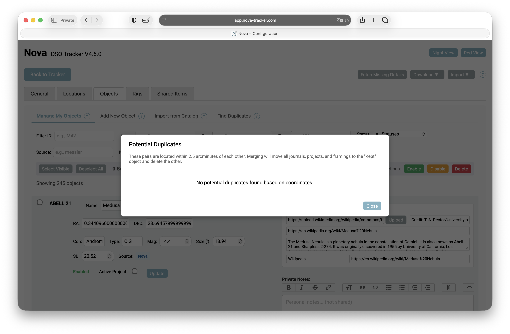

# Nova DSO Tracker

A Flask-based web application designed specifically for astrophotographers, providing essential data for tracking deep-sky objects (DSOs), planning imaging projects, and logging sessions.

## Features

* **New in 4.6.0: Night Explorer (Inspiration Tab):** A visual gallery displaying targets currently visible from your location. It prioritizes objects high in the sky and allows you to browse potential targets visually rather than by data lists alone.
* **New in 4.6.0: Advanced Object Management:** A completely overhauled configuration interface allows for bulk actions. You can now filter objects by catalog source, select multiple items, and enable or disable them from calculations without deleting them.
* **New in 4.6.0: Duplicate Management:** A dedicated tool to scan your database for objects with similar coordinates (e.g., M101 and NGC 5457) and merge them into a single entry.
* **New in 4.6.0: Custom Imagery & Inspiration:** You can now link your own astrophotos to objects. These images appear in the Inspiration tab and the new "Inspiration" sub-tab within the object detail view.
* **New in 4.6.0: Contextual Help:** Help badges have been added throughout the application to provide immediate documentation for specific features.
* **New in 4.6.0: Dark Theme:** The interface now supports a dark mode for better usability during night imaging sessions.
* **New in 4.4.0: Mosaic Planning & Export:** Plan multi-pane mosaics directly in the Framing Assistant. Export plans as CSV for import into ASIAIR or N.I.N.A.
* **New in 4.3.0: Yearly Heatmap:** A "Waterfall Heatmap" visualization for long-term target visibility assessment over the next 12 months.
* **New in 4.2.0: Core Database Architecture:** A complete migration from flat YAML files to a robust SQLite database backend.
* **New in 4.1.0: Project Management:** Group multiple imaging sessions into dedicated Projects. Track total integration time, set goals, and monitor status.
* **New in 4.1.0: Rig Snapshots:** Nova records equipment specs at the moment of logging a session, preserving historical data accuracy even if equipment changes later.
* **Real-time Tracking:** Altitude and azimuth tracking for DSOs updated every minute.
* **Visibility Forecasts:** "Outlook" calculations based on altitude, moon illumination, and angular separation.

## Technologies Used

* **Backend:** Python (Flask, SQLAlchemy, AstroPy, Ephem)
* **Database:** SQLite
* **Frontend:** HTML5, JavaScript, Aladin Lite
* **Integrations:** SIMBAD (Object data), Stellarium (Planetarium control)

---

# Nova DSO Tracker - User Guide

### Purpose

Nova helps track Deep Sky Objects (DSOs) positions throughout the night for astrophotography or visual observations. It updates positions every minute, highlights objects marked for attention, and provides graphical insights into visibility, moon illumination, and imaging windows.

### Main Interface (The Dashboard)

When opening Nova, you see a list of DSOs sorted by default by their current altitude.

* **Highlights:** Objects with active project notes are highlighted.
* **Altitude Color Coding:** Altitudes above your defined threshold appear in green.
* **Horizon Mask:** If a Horizon Mask is defined and an object is obstructed by terrain, the field turns yellow.
* **Observable Window:** The "Observable" column shows the minutes an object is visible between astronomical dusk and dawn.




### Sorting, Filtering, and Saved Views

  * **Sorting:** Click column headers to sort. A second click reverses the order.
  * **Filtering:** Each column has a search box. You can use operators like `>` (greater than), `<` (less than), or `!` (exclude).
      * *Example:* Type `>45` in the Altitude column to see only objects currently high in the sky.
      * *Example:* Type `Galaxy` in the Type column.
  * **Saved Views (New in v4.1):** You can now save a specific combination of filters and sort orders.
    1.  Set up your filters (e.g., "Nebulae", "Altitude \> 30").
    2.  Click the **"Views"** dropdown.
    3.  Save the view (e.g., "Good Nebulae").
    4.  **Sharing:** You can mark a view as "Shared" to let other users on your server use it.

### Visual Discovery: The Inspiration Tab (Night Explorer)

The Inspiration Tab offers a visual way to browse potential targets. Instead of a data table, this view presents tiles for objects that are currently observable.

* **Smart Sorting:** Objects are prioritized based on their current altitude and visibility duration.
* **Imagery:** Tiles display survey images (DSS2) by default. If you have uploaded your own astrophoto for an object, it will be displayed here.
* **Quick Info:** Each tile displays the object's type, current altitude, and constellation. Clicking a tile opens a detail modal with a summary and a link to the full charts.




### Long-Term Planning: The Yearly Heatmap

The Yearly Heatmap visualizes target visibility over the next 12 months.

  * **Waterfall Visualization:** This chart visualizes target visibility over the next 12 months. Darker green indicates higher quality imaging time, while vertical white bands highlight full moon periods where imaging may be difficult.
  * **Data Loading:** To ensure performance, data is loaded in chunks and stored for 24hrs.
  * **Integrated Filtering:** You can apply your "Saved Views" directly to this heatmap to narrow down targets (e.g., only show "Galaxies").
  * **Active Only:** A checkbox allows you to quickly filter the view to show only your currently active projects.



### Projects & Imaging Journal

The Journal has been completely overhauled. It is no longer just a flat list of entries; it is a **Project Management System**.


1.  **Projects:** A Project groups multiple imaging sessions toward a single goal (e.g., "Mosaic of M31" or "HaOIII data for Helix").

      * **Status:** Track if a project is `In Progress`, `Completed`, or `Abandoned`.
      * **Integration:** Nova automatically sums the exposure time from all linked sessions to show total integration time.
      * **Notes:** Keep project-level notes (framing plans, processing goals) separate from nightly session notes.

2.  **Planning Mode ("New Project"):**
    You no longer need to wait until you have data to create an entry. Use the **"New Project"** button to plan targets ahead of time. This creates a container for your future data.



3.  **Rig Snapshots:**
    When you add a session, Nova records a **Snapshot** of your rig's metrics (Focal Length, F-Ratio, Camera).

      * *Why?* If you change your telescope configuration in 6 months, the history of your old sessions remains accurate. It will not be overwritten by your new settings.

4.  **Reports:**
    You can generate PDF reports for a specific night (Session Report) or a summary of an entire target (Project Report).

### Detailed Object Information

Clicking a DSO in the main list opens the Detailed View.

  * **Altitude Graphs:** Shows the object's path for the current night.
  * **Moon Separation:** Displays angular separation from the moon.
  * **Imaging Opportunities:** Click "Find Imaging Opportunities" to calculate the best dates for imaging this object based on your specific horizon and moon constraints.


**Framing Assistant:**
The "Show Framing" button opens the Aladin-based framing tool.

  * **Local Data:** It uses the *exact* RA/Dec from your database (not a generic catalog) to ensure the framing matches your mount's coordinates.
  * **Overlays:** You can overlay **other objects** from your database onto the image. This is incredibly useful for planning mosaics or checking if a nearby bright star is in your Field of View.


**Mosaic Planning (New in v4.4):**
You can now plan multi-panel mosaics directly within Nova.

1.  **Grid Configuration:** Define the number of columns and rows (e.g., 2x2).
2.  **Overlap:** Set the percentage of overlap between panels (default 10%).
3.  **Rotation:** Adjust the camera rotation angle.

**Exporting Plans:**
Once your framing or mosaic is set, use the **"Copy Plan (CSV)"** button. This generates a CSV format compatible with:

  * **ASIAIR:** Import via Plan -\> Import.
  * **N.I.N.A.:** Import into the Sequencer.


### Configuration and Object Management

The Configuration page manages your library of objects, locations, and equipment.

  * **Locations:** Manage observing sites. You can define **Horizon Masks** here (uploading a CSV/YAML list of Azimuth/Altitude points) to block out trees or buildings.
  * **Objects:**
      * **Smart Add:** When adding an object (e.g., "M 42"), Nova first checks your local database for duplicates (e.g., "M42"). If not found, it queries SIMBAD.
      * **Import Catalog:** Download curated lists (Messier, Caldwell, etc.) directly from the Nova server.
  * **Rigs:** Define your optical trains. Accurate data here is required for the **Framing Assistant** and **Rig Snapshots**.





**Manage Objects:**
Version 4.6 introduces advanced management tools:

* **Filtering:** Use the filter bar to find objects by ID, Name, Type, or **Source** (e.g., filter by 'Messier' to see only objects imported from that catalog).
* **Bulk Actions:** Select multiple objects using the checkboxes. You can then **Enable** or **Disable** them. Disabled objects remain in your database but are excluded from calculations and the main dashboard list.
* **Inspiration Content:** In the edit view of an object, you can now upload a custom image URL, credit, and description text.


**Duplicate Manager:**
Use the "Find Duplicates" button to scan your library. Nova identifies objects with coordinates within 2.5 arcminutes of each other (e.g., `M101` and `NGC5457`). You can choose which entry to keep; Nova will automatically migrate all journal entries and projects to the kept object before deleting the duplicate.



---
# Nova Astronomical Tracker Setup Guide

The easiest way to install Nova DSO Tracker is via Docker.

[](https://youtu.be/CF__VZEtH_I)


### Docker Image:

A pre-built Docker image is available on Docker Hub for easy setup:

[](https://hub.docker.com/r/mrantonsg/nova-dso-tracker)

**[View on Docker Hub: mrantonsg/nova-dso-tracker](https://hub.docker.com/r/mrantonsg/nova-dso-tracker)**

See the Docker Hub page for instructions on how to run the container.


### Manual Docker Installation

1. **Pull the image:**
```bash
docker pull mrantonsg/nova-dso-tracker

```


2. **Run the container:**
You must mount a volume to `/app/instance` to persist your database.
```bash
docker run -d \
  -p 5000:5000 \
  -v nova_data:/app/instance \
  --name nova \
  mrantonsg/nova-dso-tracker

```


### Manual Python Installation

1. **Clone the repository:**
```bash
git clone https://github.com/mrantonSG/nova_DSO_tracker.git
cd nova_DSO_tracker

```


2. **Create a Virtual Environment:**
```bash
python3 -m venv nova
source nova/bin/activate

```


3. **Install Dependencies:**
```bash
pip install -r requirements.txt

```


4. **Run the Application:**
```bash
python nova.py

```


Access the application at `http://localhost:5001`.

### User Modes

Nova supports two modes, configured in `instance/.env`:

  * **Single-user mode (Default):** No login required. The app assumes one user ("default") and bypasses authentication.
  * **Multi-user mode:** Ideal for hosting on a public server. Requires user registration and login.
      * To enable, set `SINGLE_USER_MODE=False` in your `.env` file.

### License

Nova DSO Tracker is licensed under the Apache 2.0 License **with the Commons Clause**.
Free for personal, educational, and non-commercial use only. Commercial use requires explicit permission.