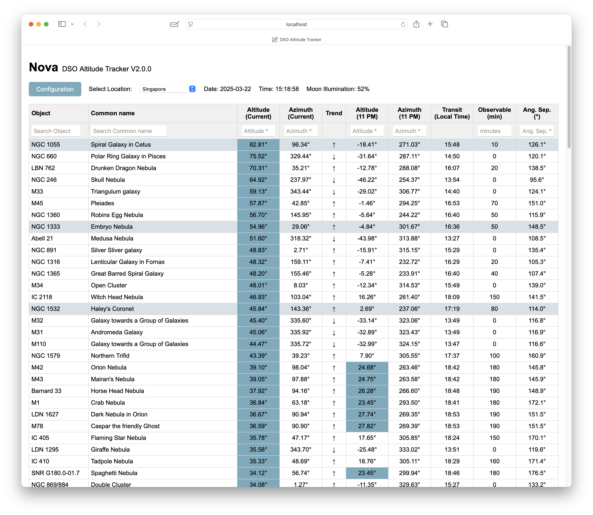
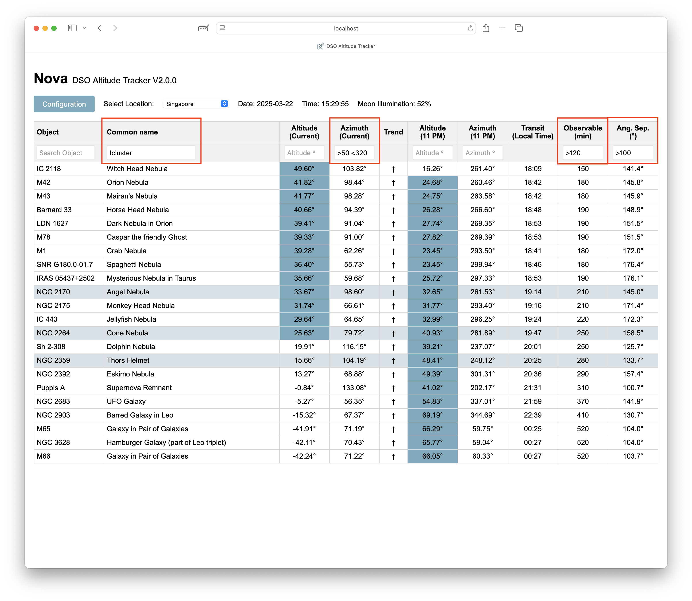
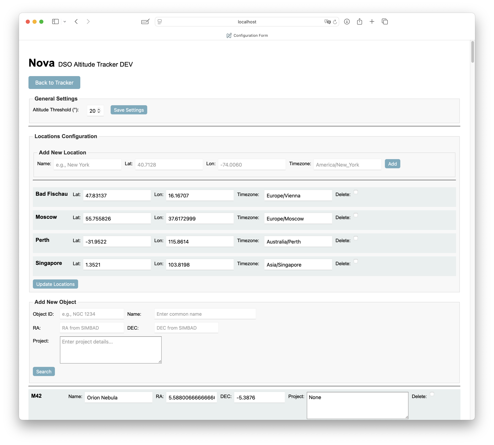
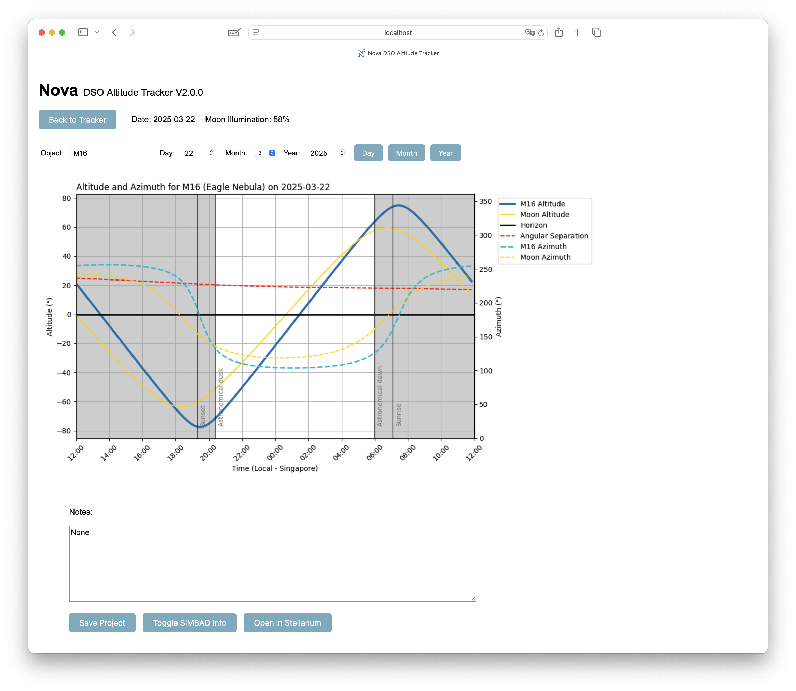
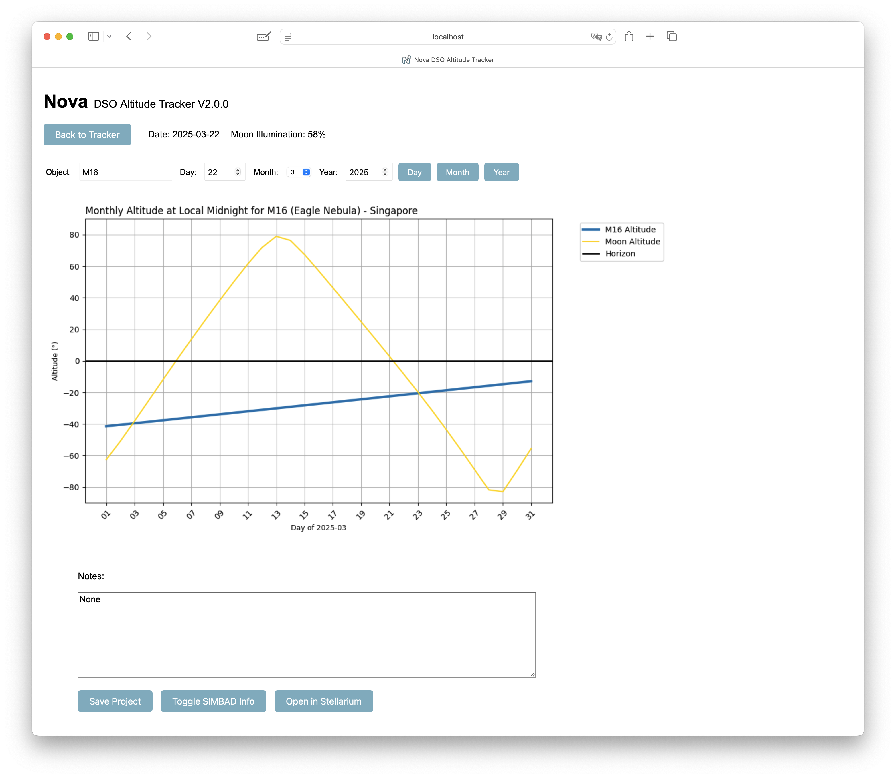
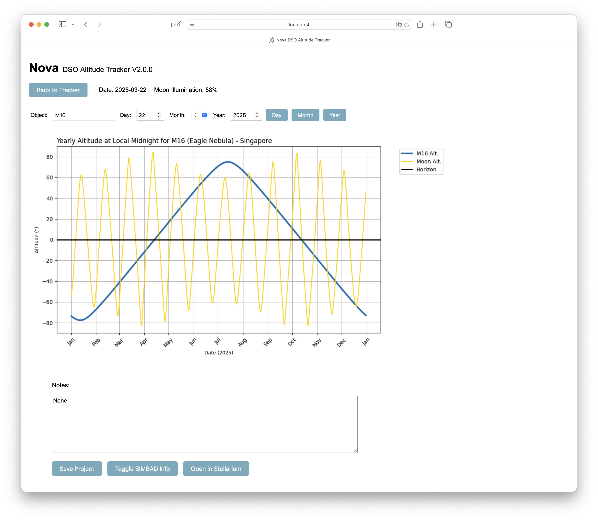

# Nova DSO Altitude Tracker 2.0 - Quick Guide

### Purpose
Nova helps track Deep Sky Objects (DSOs) positions throughout the night for astrophotography or visual observations.

Nova updates DSOs' positions every minute. Objects marked for special attention are highlighted. It also displays the Moon's illumination and provides graphical insights into the objects' positions throughout the night.

Positions (RA, DEC) are automatically fetched from SIMBAD. Altitude (Alt) and Azimuth (Az) calculations are performed in real time, with updates reflected every minute on the web interface.

### Main Interface
When opening Nova, you'll see a list of DSOs sorted by their current altitude (descending order). Objects with project notes are highlighted. You'll also see the date, local time at your selected location, and current Moon illumination. Altitudes above a definable threshold are highlighted. Under "Observable" you can find the time in minutes an object is above the altitude threshold (default 20°) and between astronomical dusk and dawn. New in Version 2 is the column with the angular separation of the object to the moon.



### Sorting and Searching
- **Sorting:** By default, objects are sorted by descending altitude. You can change sorting by clicking on column headers. Clicking twice reverses the sorting order.
- **Searching:** Each column header includes a search field allowing filtering. You can combine search terms and use logical operators like `<` or `>` for refined filtering. With `!` you can exclude content. Nova retains your sorting and filtering choices until you alter them.



### Configuration
Nova comes pre-loaded with several DSOs. You can manage (add, remove, or edit) locations and objects from the configuration screen. To add an object, enter its ID and click `search`. This will trigger a SIMBAD search. If an object was found you can edit its name and project fields and finally add it to your list.

- **Object Designations:** SIMBAD may not recognize all object IDs. You can however add objects also manually. In that case you need to enter RA and DEC.
- **Highlighting Objects:** Entering text in the "Project" field highlights the corresponding object in the main interface. The main purpose is to mark objects you plan to image. In the project field you can put all necessary information, such as the rig you plan to use.



### Detailed Object Information
Clicking on a DSO in the main list opens detailed graphical information about its nightly position and altitude. These graphics are generated on-demand and might take a few seconds to appear, depending on your computer's performance. 
New in V2 is the possibility to not only see the current night, but you can select a date you want to see. Just select the day and or month and year and click on "Day".
Also new are a monthly and yearly view of the object and the moon.







---

# Nova Astronomical Tracker Setup Guide

This guide walks you through setting up your Flask astronomical tracking app, including creating a virtual environment and installing all required dependencies.

## 1. Install Python 3 (if applicable)

Using **Homebrew** (recommended):

1. Open **Terminal**.
2. Install Python 3 by running:

```bash
brew install python
```

3. Verify the installation:

```bash
python3 --version
pip3 --version
```

## 2. Create a Project Directory

1. Open **Terminal**.

  (Optional) change the directory to where you want the software folder to be installed

2. Clone the repository and open the new directory

```bash
git clone https://github.com/mrantonSG/nova_DSO_tracker.git
cd nova_DSO_tracker
```

## 3. Set Up a Virtual Environment

A virtual environment keeps your project's dependencies isolated.

1. Create a virtual environment named `nova`:

```bash
python3 -m venv nova
```

2. Activate the virtual environment:

```bash
source nova/bin/activate
```

Your terminal prompt should now start with `(nova)`.

## 4. Install Required Dependencies

Install the required Python packages:

```bash
pip install Flask numpy pytz ephem PyYAML matplotlib astroquery astropy flask_login python-decouple python-dotenv
```

(Optional) Verify installed packages:

```bash
pip freeze
```

## 5. Run the Application

1. With your virtual environment activated, run:

```bash
python nova.py
```

2. Open your browser and navigate to:

```
http://localhost:5001
```

*Note: The first startup may take a minute.*

## 6. (Optional) Deactivate the Virtual Environment

When finished, deactivate by running:

```bash
deactivate
```

## 7. (Optional) Running it in the background

if you want to close the terminal window, for instance after starting the software on a server, start it like that:

```bash
setsid python3 nova.py > app.log 2>&1 &
```

once you want to later stop it, look for the process:

```bash
ps aux | grep python
```

and stop it:

```bash
kill <the number you've found>
```

## Additional Notes

### Multi‑user vs. Single‑user Mode:
The app can be configured for multi‑user mode (using separate configuration files per user) or single‑user mode (using a single file like config_default.yaml). However, this functionality is still experimental.

### Installation on a server:
In case you want to have access from various different devices (computers, iPad ...) from within or outside of your home network, you can install it on a server. A Raspberry pi5 works fine, you just need to accept short delays when switching locations or clicking on objects, but overall the performance is sufficient. In order to still being able to send objects to Stellarium, please read "[stellarium_access_from_server](stellarium_access_from_server.md)".

### Upgrading from an older version:
First step: copy your config yaml to a safe place. You can now replace the files in your nova directory or you do a clean install (recommended)
For the clean install you just follow the setup guide. Once all steps are done, copy your config yaml back into the new folder and start the app.

clear skies!
