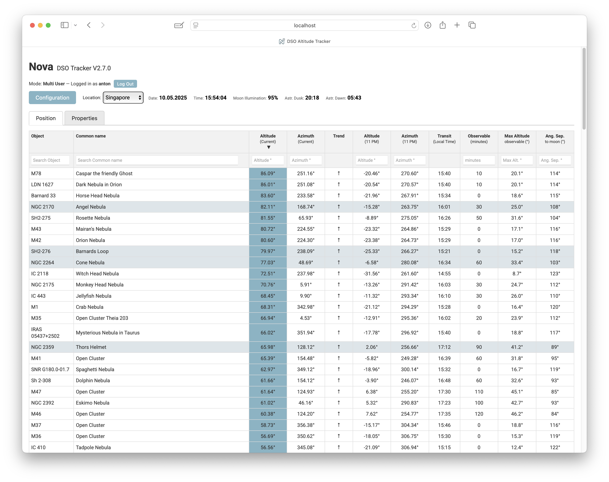
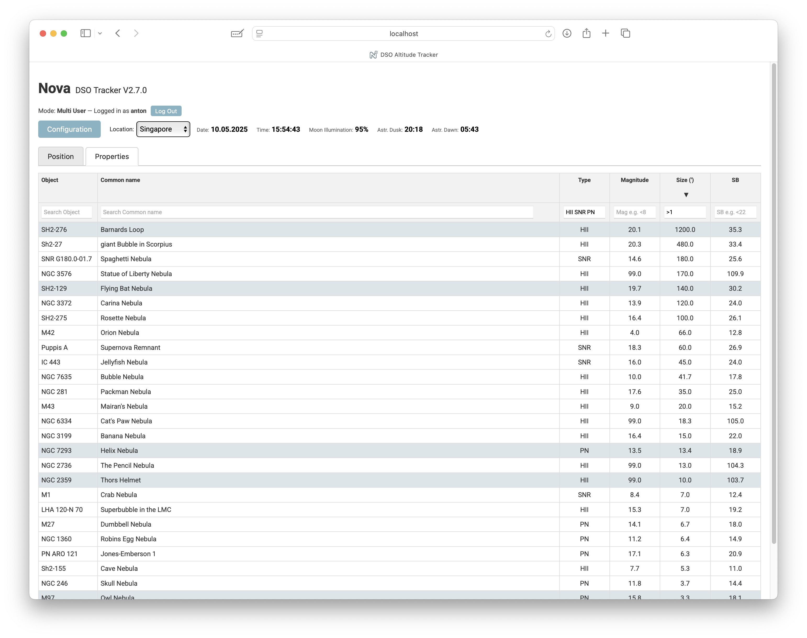
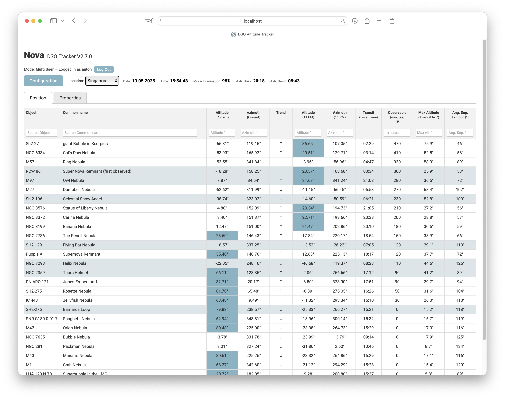
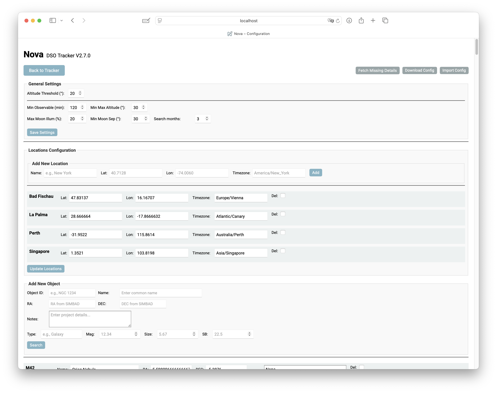
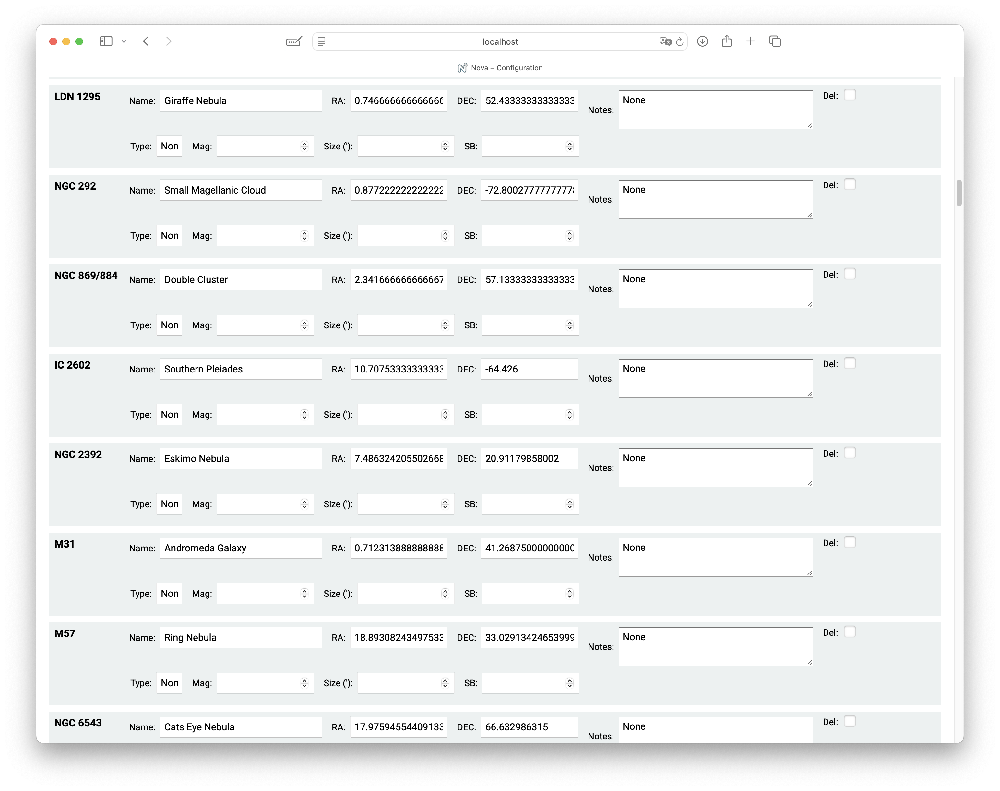
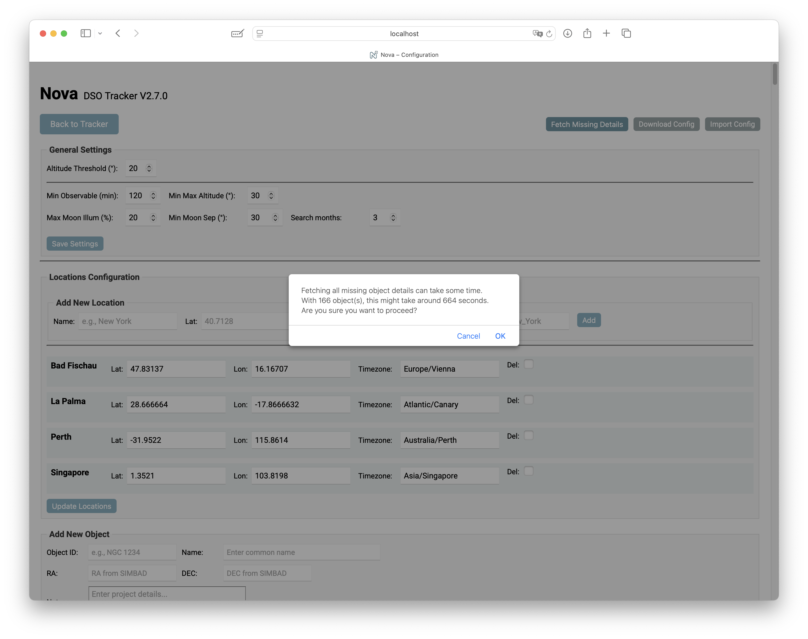
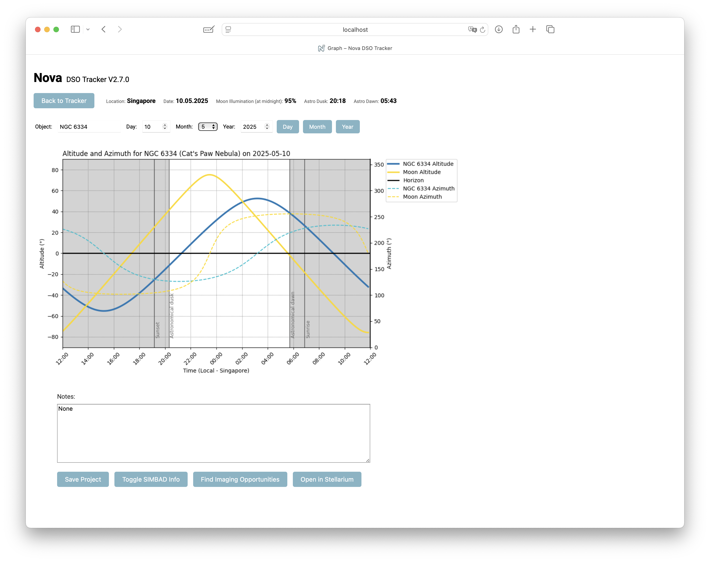
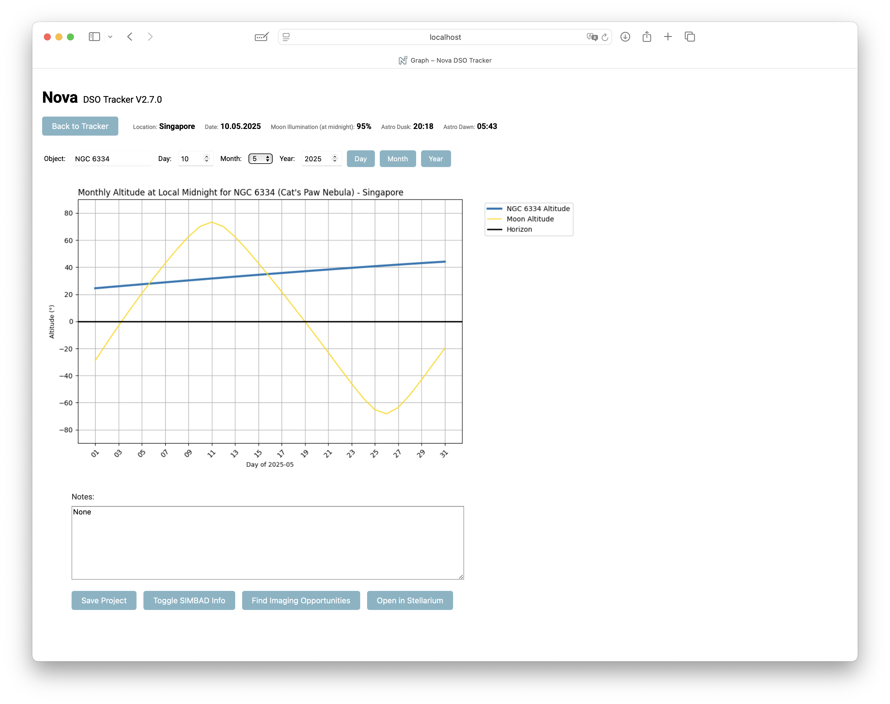
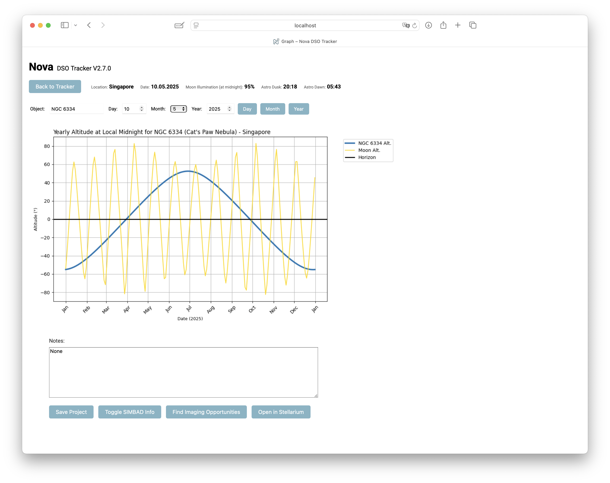
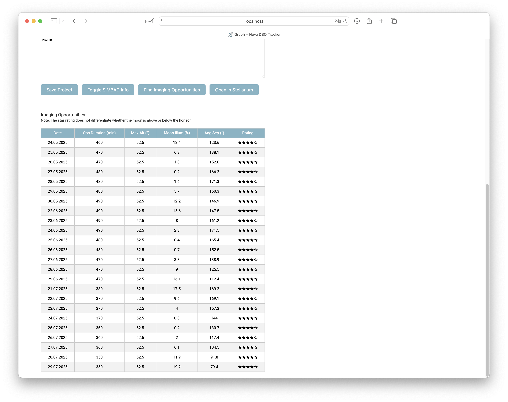

# Nova DSO Tracker

A Flask-based web application designed specifically for astrophotographers, providing essential data for tracking deep-sky objects (DSOs).

## Features
- Real-time altitude and azimuth tracking for DSOs
- Visibility forecasts based on altitude, moon illumination, and angular separation
- Integration with Stellarium for live sky visualization
- Customizable imaging opportunity alerts

## Technologies Used
- Python (Flask, AstroPy, Ephem)
- Raspberry Pi compatible
- API integrations (SIMBAD, Stellarium)

# Nova DSO Altitude Tracker 2.7 - Quick Guide

### Purpose
Nova helps track Deep Sky Objects (DSOs) positions throughout the night for astrophotography or visual observations.

Nova updates DSOs' positions every minute. Objects marked for special attention are highlighted. It also displays the Moon's illumination and provides graphical insights into the objects' positions throughout the night.

Positions (RA, DEC) are automatically fetched from SIMBAD. Altitude (Alt) and Azimuth (Az) calculations are performed in real time, with updates reflected every minute on the web interface.

In addition it provides information about the angular separation between the objects and the moon, the time they can be imaged and the maximum altitude they reach during this time.

New with V 2.7 - additional DSO data are downloaded from various online catalogs.

### Main Interface
When opening Nova, you'll see a list of DSOs sorted by their current altitude (descending order). Objects with project notes are highlighted. You'll also see the date, local time at your selected location, and current Moon illumination. Altitudes above a definable threshold are highlighted. Under "Observable" you can find the time in minutes an object is above the altitude threshold (default 20°) and between astronomical dusk and dawn. New in Version 2 is the column with the angular separation of the object to the moon.

New in Version 2.7 are the two tabs in the layout. 
The first "Position" contains all fields you are used to from the previous versions. The second tab "Properties" contain new, object specific fields.



### Sorting and Searching
- **Sorting:** By default, objects are sorted by descending altitude. You can change sorting by clicking on column headers. Clicking twice reverses the sorting order. Also new in 2.7 is the sorting indicator for every column.

- **Searching:** Each column header includes a search field allowing filtering. You can combine search terms and use logical operators like `<` or `>` for refined filtering. With `!` you can exclude content. Nova retains your sorting and filtering choices until you alter them.

- You can now also add multiple phrases in a search field. For example multiple DSO types:



and you can combine filters and sorting from both tabs:



In this example the objects are sorted by maximum observation time. 
In combination with the filter under "Properties" this shows potential observation time only for the DSO type selected.
If you have only a limited view to the sky, for instance because you image from a balcony, you can also set azimuth filters, to focus on objects actually visible to you.
Once you set the sorting order and filters, the screen will continue updating every minute, so you can see where the the objects are at any moment. These settings will stay even when switch screens, until you manually reset them.

### Configuration
Nova comes pre-loaded with several DSOs. You can manage (add, remove, or edit) locations and objects from the configuration screen. To add an object, enter its ID and click `search`. This will trigger a SIMBAD search. If an object was found you can edit its name and project fields and finally add it to your list.
All you settings and objects are stored in a single .yaml file which you can find in the main directory. When ever you update your installation, move it to another computer etc, make sure you keep this file (config_default.yaml in single user mode or config_username.yaml in a multiuser setup)

- **Object Designations:** SIMBAD may not recognize all object IDs. You can however add objects also manually. In that case you need to enter RA and DEC.
- **Highlighting Objects:** Entering text in the "Notes" field (project in the yaml file) highlights the corresponding object in the main interface. The main purpose is to mark objects you plan to image. In the project field you can put all necessary information, such as the rig you plan to use.

The configuration, including all locations objects and settings, can be downloaded as well as uploaded. When uploading the configuration file it doesnt matter how it is named, it will be automatically renamed to match the user ID (in MUM) or the default name (in SUM)



### Importing / upgrading your configuration to V 2.7
Since nova now includes more information, the configuration yaml file needs to be updated.
After installing 2.7, you can import your previous config yaml file. 
However - you will notice that the additional fields remain empty:



What you need to do is to press the "Fetch Missing Details" button. A message will pop up reminding you that this process will take some time.



In order to successfully add the information, your system needs to be connected to the internet.
Nova will query multiple catalogs to find the requested information. If you have Stellarium on your computer, you should open it as well - nova will use it as fallback if the search in the various catalogs was not successful.

After pressing "ok" just wait until the page reloads. 
If everything went well, you can find the additional fields now filled out


### Detailed Object Information
Clicking on a DSO in the main list opens detailed graphical information about its nightly position and altitude. These graphics are generated on-demand and might take a few seconds to appear, depending on your computer's performance. 
New in V2 is the possibility to not only see the current night, but you can select a date you want to see. Just select the day and or month and year and click on "Day".
Also new are a monthly and yearly view of the object and the moon.







If you click on the button "Find Imaging Opportunities", you will get a list of dates when imaging the selected object is possible.



You can edit the selection criteria for the opportunity search in the configuration settings.


# Nova Astronomical Tracker Setup Guide

This guide walks you through setting up your Flask astronomical tracking app, including creating a virtual environment and installing all required dependencies.

## 1. Install Python 3 (if applicable)

Using **Homebrew** (recommended):

1. Open **Terminal**.
2. Install Python 3 by running:

```bash
brew install python
```

3. Verify the installation:

```bash
python3 --version
pip3 --version
```

## 2. Create a Project Directory

1. Open **Terminal**.

  (Optional) change the directory to where you want the software folder to be installed

2. Clone the repository and open the new directory

```bash
git clone https://github.com/mrantonSG/nova_DSO_tracker.git
cd nova_DSO_tracker
```

## 3. Set Up a Virtual Environment

A virtual environment keeps your project's dependencies isolated.

1. Create a virtual environment named `nova`:

```bash
python3 -m venv nova
```

2. Activate the virtual environment:

```bash
source nova/bin/activate
```

Your terminal prompt should now start with `(nova)`.

## 4. Install Required Dependencies

Install the required Python packages:

```bash
pip install Flask numpy pytz ephem PyYAML matplotlib astroquery astropy flask_login python-decouple python-dotenv cerberus
```

(Optional) Verify installed packages:

```bash
pip freeze
```

## 5. Run the Application

1. With your virtual environment activated, run:

```bash
python nova.py
```

2. Open your browser and navigate to:

```
http://localhost:5001
```

*Note: The first startup may take a minute.*

## 6. (Optional) Deactivate the Virtual Environment

When finished, deactivate by running:

```bash
deactivate
```

## 7. (Optional) Running it in the background

if you want to close the terminal window, for instance after starting the software on a server, start it like that:

```bash
nohup python3 nova.py > app.log 2>&1 &
```

once you want to later stop it, look for the process:

```bash
ps aux | grep python
```

and stop it:

```bash
kill <the number you've found>
```

## Additional Notes


### User Modes in Nova

Nova supports two user modes:

- **Single-user mode**: Uses a single configuration file (`config_default.yaml`). This is the default setting.
- **Multi-user mode**: Each user has a separate configuration file. Ideal for embedding into external websites where advanced user management is handled externally.

Basic user management is built-in primarily for testing or simple use cases, with user credentials (IDs and passwords) stored securely in the `.env` file. For integration into a website, it's recommended to handle user management via the website itself.

Additionally, Nova supports a limited **guest mode** when running in multi-user mode. Guest mode provides automatic access without requiring login credentials, offering a basic overview and limited functionality to give new users a general impression of the app.

### Switching Modes

To enable multi-user mode, update or add the following line in your `.env` file:

```env
SINGLE_USER_MODE=False
```

To revert to single-user mode:
```env
SINGLE_USER_MODE=True
```


### Installation on a server:
In case you want to have access from various different devices (computers, iPad ...) from within or outside of your home network, you can install it on a server. The software is now optimized to run on a Raspberry Pi5 with good performance. In order to still being able to send objects to Stellarium, please read "[stellarium_access_from_server](stellarium_access_from_server.md)".
#### 💡 Tip for Raspberry Pi 5: 
For better performance, run Nova with [Gunicorn](https://gunicorn.org), a lightweight WSGI server. Install it via pip install gunicorn, then start the app using gunicorn -w 4 -b 127.0.0.1:8090 nova:app. This reduces CPU load and improves response times compared to the built-in Flask server.

### Docker Image:
A pre-built Docker image is available on Docker Hub for easy setup:

[](https://hub.docker.com/r/mrantonsg/nova-dso-tracker)

**[View on Docker Hub: mrantonsg/nova-dso-tracker](https://hub.docker.com/r/mrantonsg/nova-dso-tracker)**

See the Docker Hub page for instructions on how to run the container.

### Upgrading from an older version:
First step: **copy your config yaml to a safe place. You can use the "download configuration" function.** After that, replace the files in your nova directory or you do a clean install (recommended)
For the clean install you just follow the setup guide. Once all steps are done, copy your config yaml back into the new folder ("upload config") and start the app.
Important note: the .env file contains relevant information, especially in multi user mode. It will not be overwritten by a new installation, but if you delete the program folder, it will be deleted as well and you should therefore create a copy of it and place it back once the installation is completed.

### License:
Nova DSO Tracker is licensed under the Apache 2.0 License **with the Commons Clause**.
Free for personal, educational, and non-commercial use only. Commercial use requires explicit permission.
See [LICENSE](LICENSE) for full details.

clear skies!
