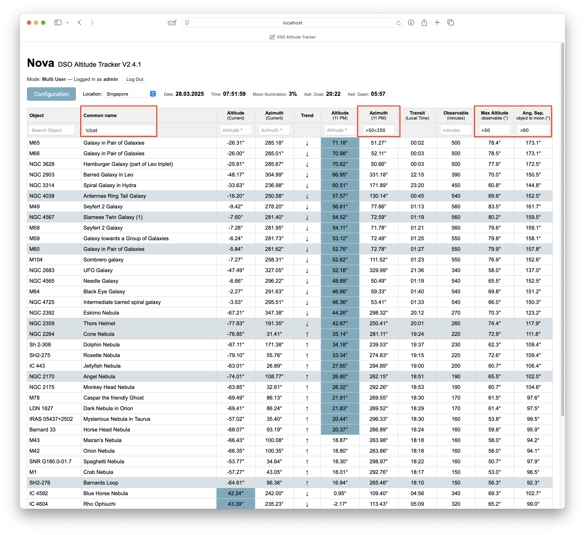
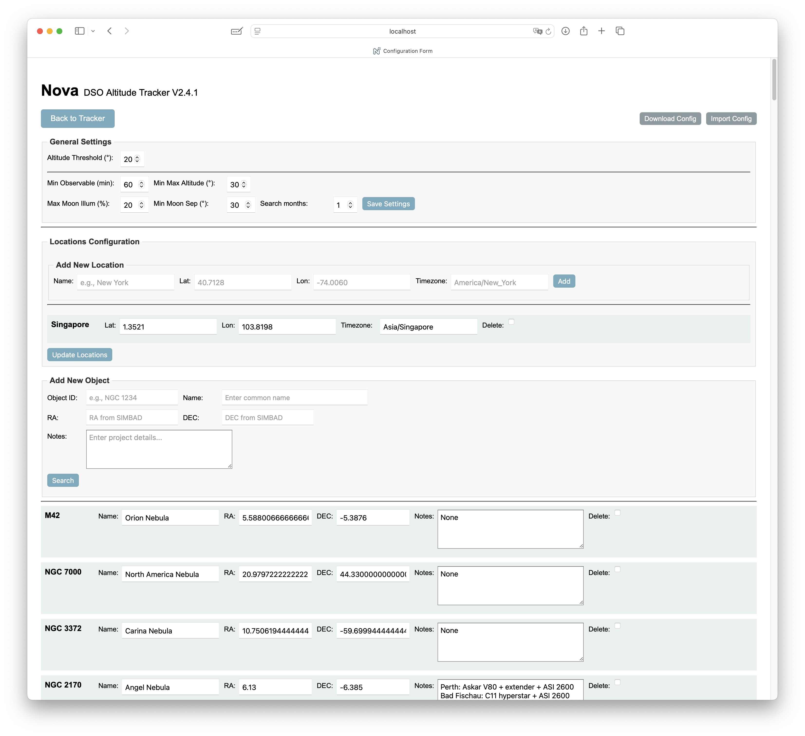
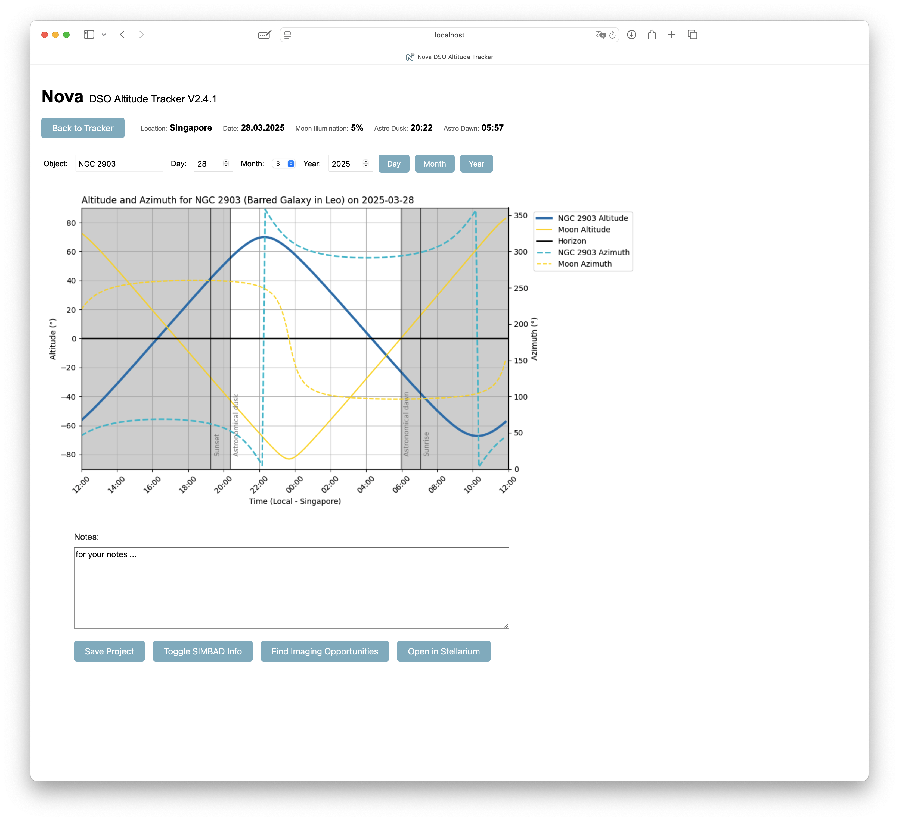
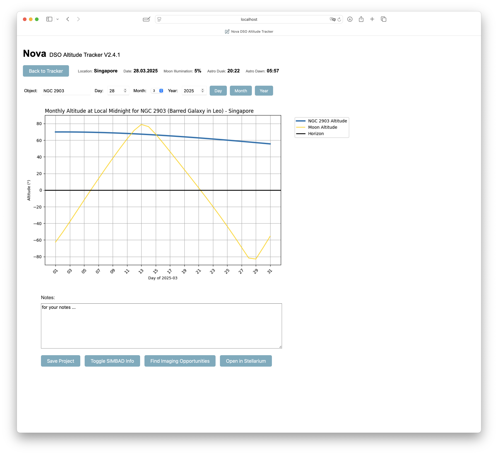
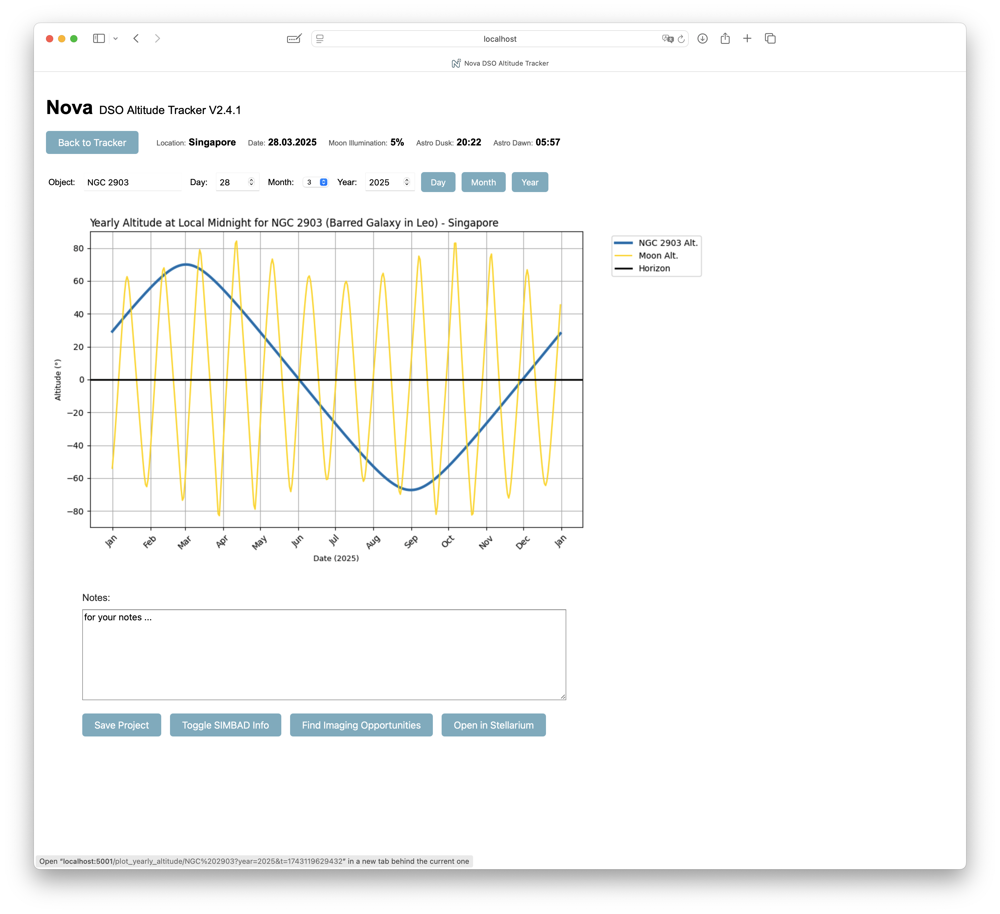
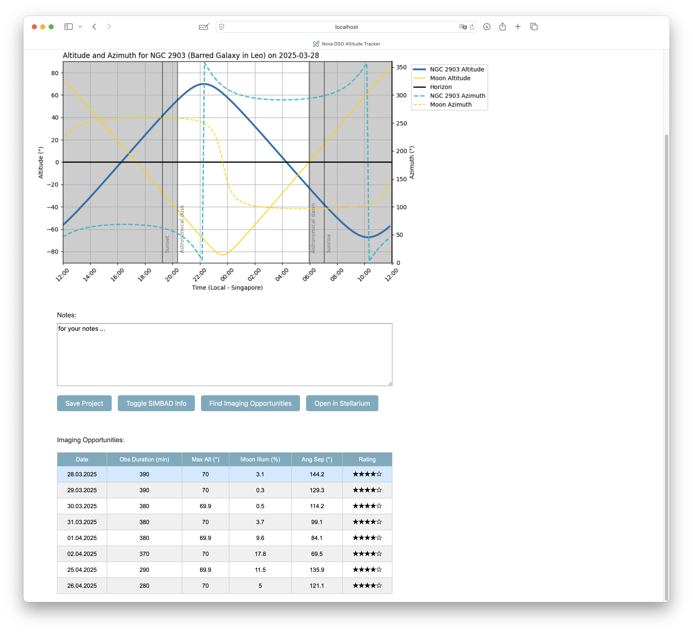
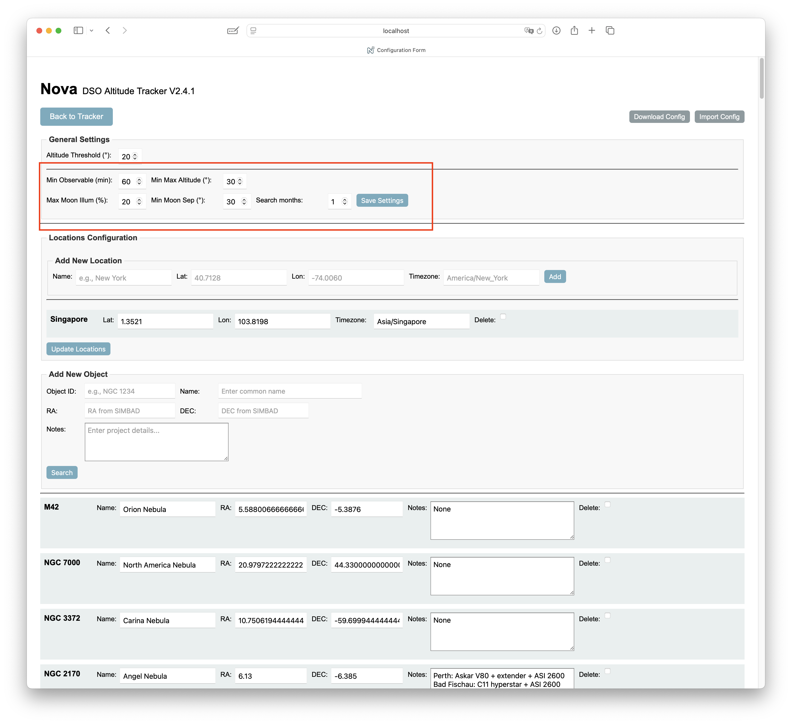

# Nova DSO Tracker

Nova DSO Tracker is a Flask-based open-source web app built for astrophotographers, enabling seamless tracking and scheduling of deep-sky object imaging sessions.

## Features
- **Real-time Altitude/Azimuth** visualization
- **Imaging Opportunities** based on moon illumination and angular separation
- **Integration** with Stellarium and SIMBAD
- User-friendly configuration for personalized observing locations and targets

### Main Interface
When opening Nova, you'll see a list of DSOs sorted by their current altitude (descending order). Objects with project notes are highlighted. You'll also see the date, local time at your selected location, and current Moon illumination. Altitudes above a definable threshold are highlighted. Under "Observable" you can find the time in minutes an object is above the altitude threshold (default 20°) and between astronomical dusk and dawn. New in Version 2 is the column with the angular separation of the object to the moon.

### Sorting and Searching
- **Sorting:** By default, objects are sorted by descending altitude. You can change sorting by clicking on column headers. Clicking twice reverses the sorting order.
- **Searching:** Each column header includes a search field allowing filtering. You can combine search terms and use logical operators like `<` or `>` for refined filtering. With `!` you can exclude content. Nova retains your sorting and filtering choices until you alter them.

In this example the objects are sorted by maximum observation time. To select objects with higher maximum altitude (during observation time) and with significant distance to the 40% illuminated moon, 2 additional filters are set. The 3rd filter excludes clusters.
If you have only a limited view to the sky, for instance because you image from a balcony, you can also set azimuth filters, to focus on objects actually visible to you.
Once you set the sorting order and filters, the screen will continue updating every minute, so you can see where the the objects are at any moment. These settings will stay even when switch screens, until you manually reset them.

### Configuration
Nova comes pre-loaded with several DSOs. You can manage (add, remove, or edit) locations and objects from the configuration screen. To add an object, enter its ID and click `search`. This will trigger a SIMBAD search. If an object was found you can edit its name and project fields and finally add it to your list.
All you settings and objects are stored in a single .yaml file which you can find in the main directory. When ever you update your installation, move it to another computer etc, make sure you keep this file (config_default.yaml in single user mode or config_username.yaml in a multiuser setup)

- **Object Designations:** SIMBAD may not recognize all object IDs. You can however add objects also manually. In that case you need to enter RA and DEC.
- **Highlighting Objects:** Entering text in the "Notes" field (project in the yaml file) highlights the corresponding object in the main interface. The main purpose is to mark objects you plan to image. In the project field you can put all necessary information, such as the rig you plan to use.

The configuration, including all locations objects and settings, can be downloaded as well as uploaded. When uploading the configuration file it doesnt matter how it is named, it will be automatically renamed to match the user ID (in MUM) or the default name (in SUM)

### Detailed Object Information
Clicking on a DSO in the main list opens detailed graphical information about its nightly position and altitude. These graphics are generated on-demand and might take a few seconds to appear, depending on your computer's performance. 
New in V2 is the possibility to not only see the current night, but you can select a date you want to see. Just select the day and or month and year and click on "Day".
Also new are a monthly and yearly view of the object and the moon.

If you click on the button "Find Imaging Opportunities", you will get a list of dates when imaging the selected object is possible.

You can edit the selection criteria in the configuration settings:

